# Frontend Mentor - Clipboard landing page solution

### Screenshot

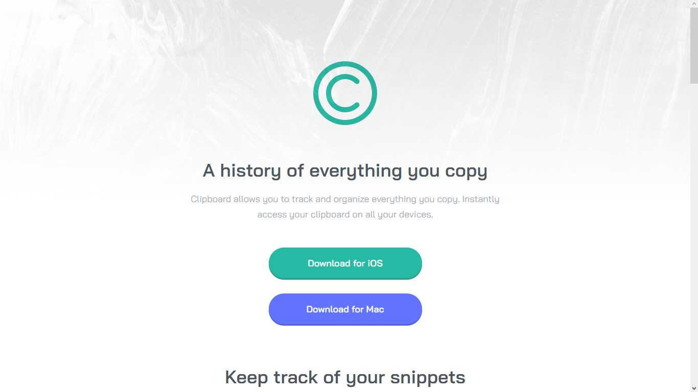
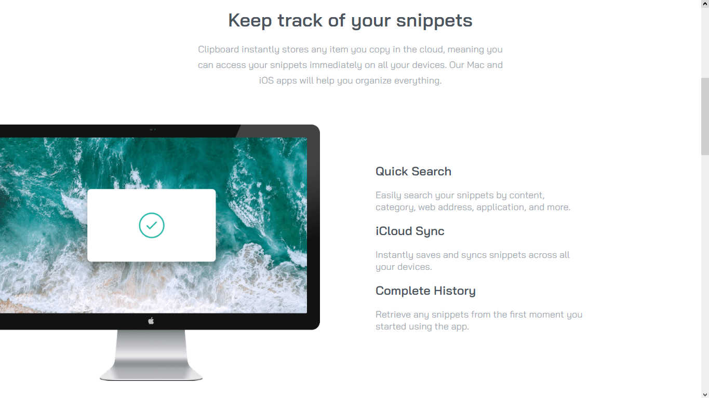
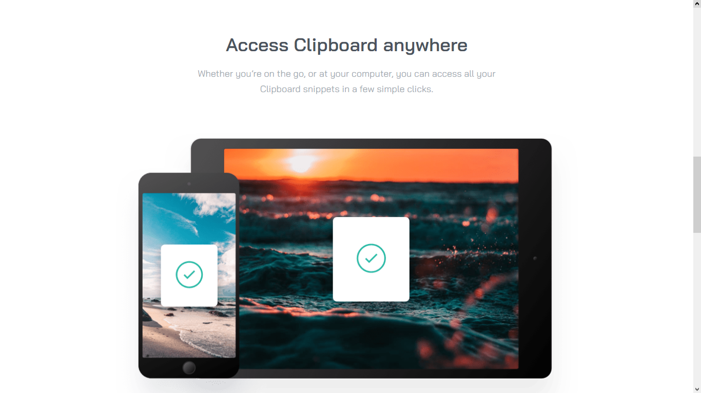
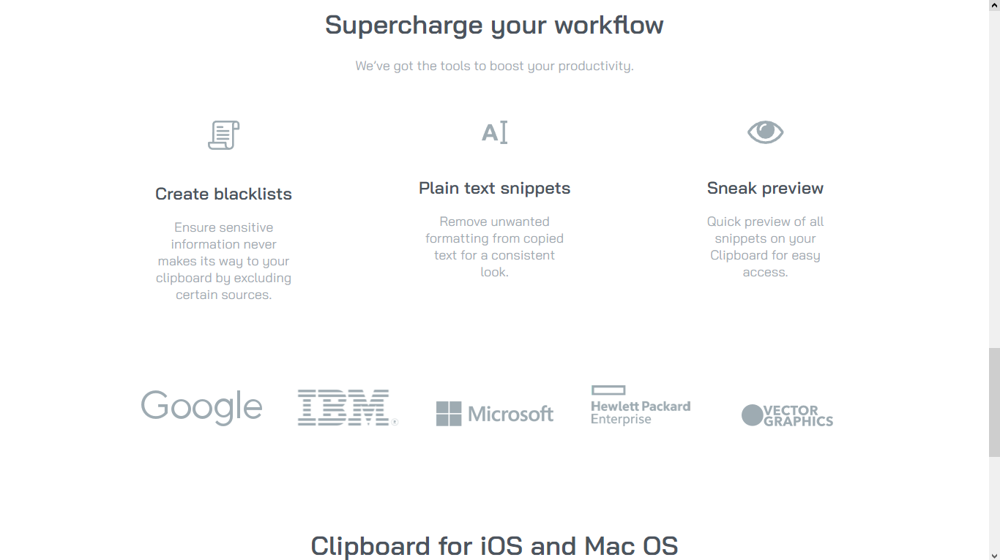
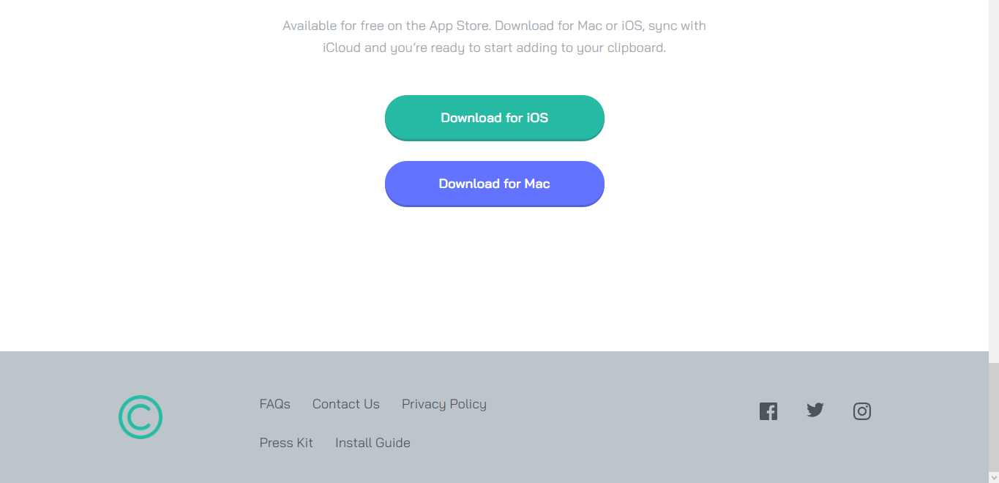

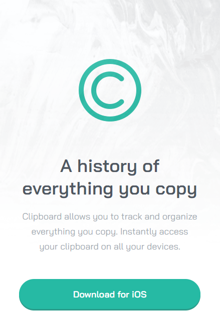
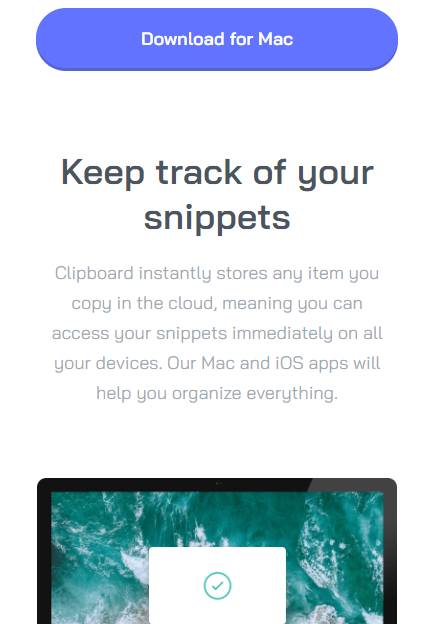
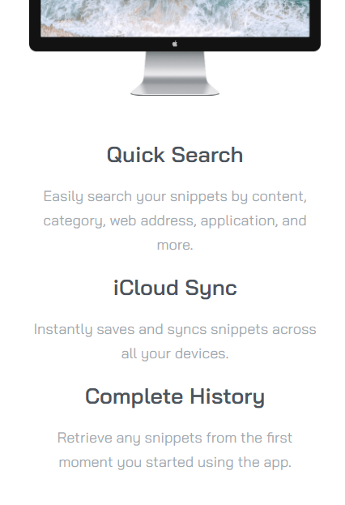
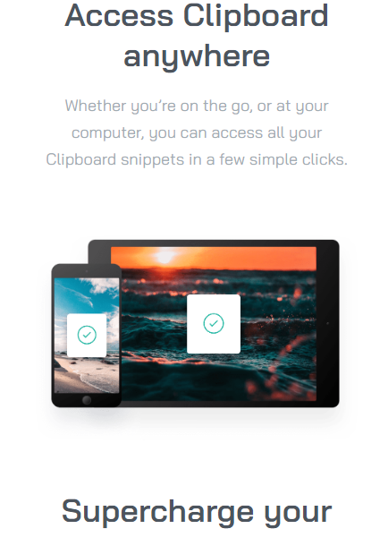
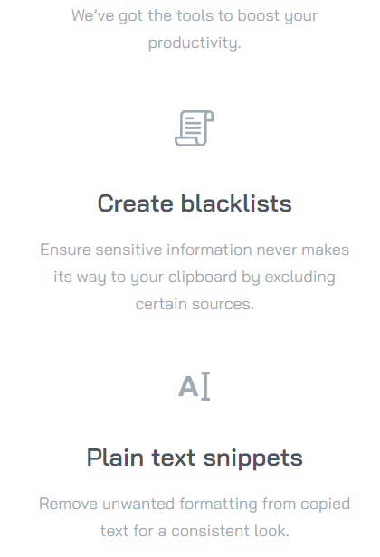
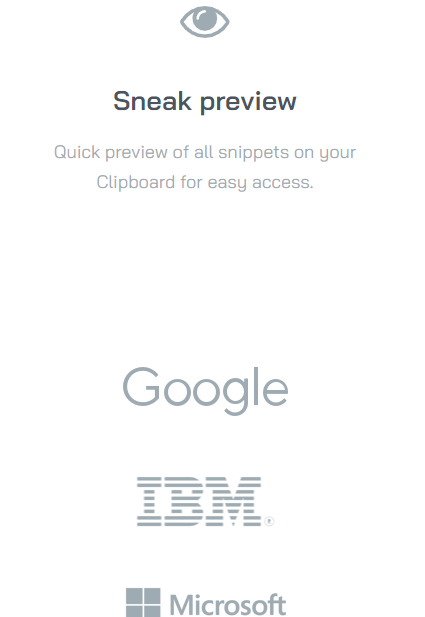
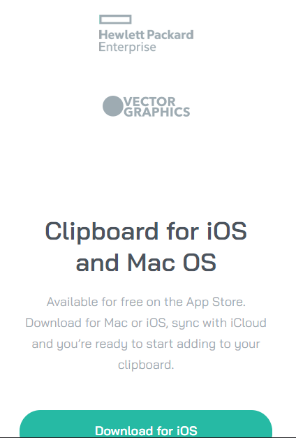
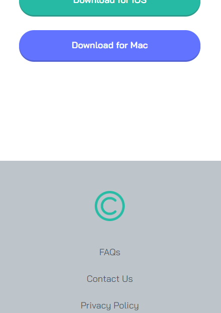
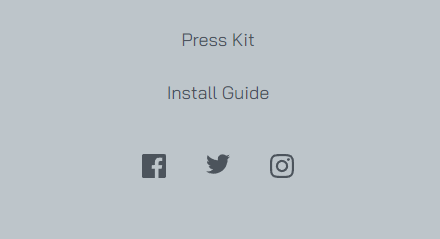

### Links

- Solution URL: [Add solution URL here](https://github.com/Wellissonb/clipboard-landing-page)
- Live Site URL: [Add live site URL here](https://wellissonb.github.io/clipboard-landing-page/)

## My process

### Built with

- Semantic HTML5 markup
- CSS custom properties
- Flexbox
- CSS Grid
- Mobile-first workflow

